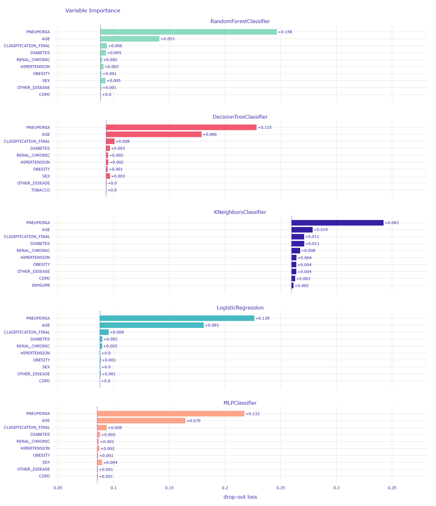
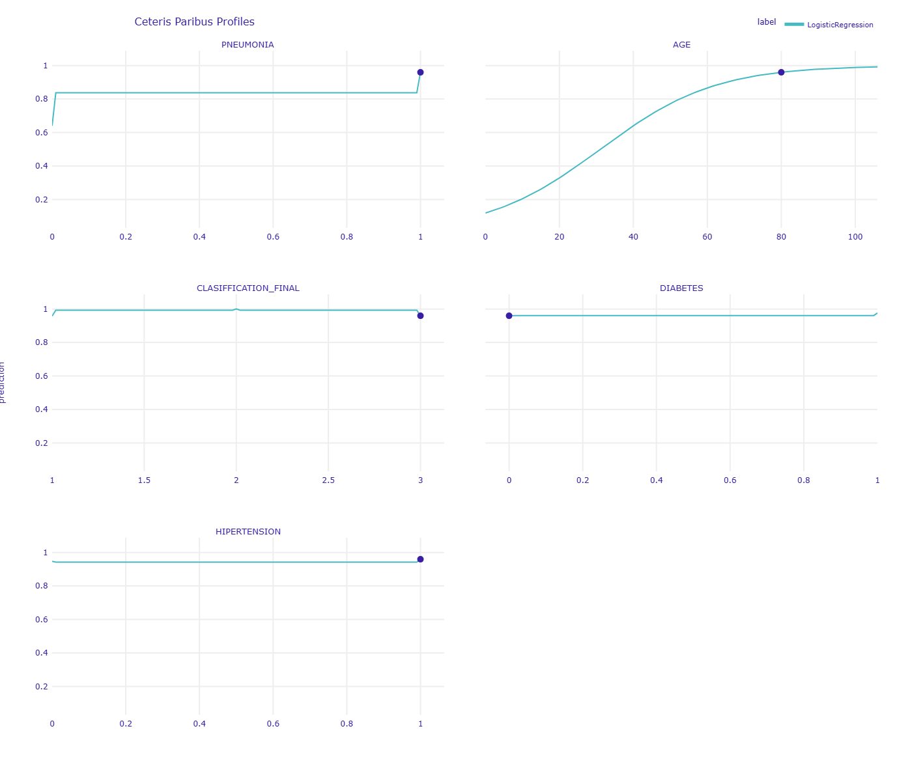

# 🏥 COVID-19 Mortality Prediction & Algorithmic Triage
**A Machine Learning Pipeline emphasizing Algorithmic Fairness, Explainable AI (XAI), and Clinical Biology.**


## 📌 Project Overview
Predicting COVID-19 mortality in a resource-scarce triage environment is not merely a mathematical exercise; it is a clinical and ethical challenge. The objective of this project is to build a machine learning pipeline capable of accurately identifying high-risk patients while strictly adhering to algorithmic fairness and biological interpretability.

This project moves beyond standard predictive modeling by deeply auditing the models for **Target Leakage**, **Sex-based Bias**, and **"Black Box" decision-making** using the `dalex` library.

## 🔬 Key Methodological Highlights

### 1. Eliminating Target Leakage
Early iterations of clinical predictive models often fall into the trap of using post-triage administrative data (e.g., Hospitalization Status, Medical Unit type). By explicitly dropping these variables, this pipeline forces the algorithms to evaluate **pure human biology and acute symptoms**, preventing target leakage and ensuring the model is valid for point-of-entry triage.

### 2. Algorithmic Fairness & Bias Mitigation
Despite high baseline accuracy (AUC > 0.90), initial fairness audits revealed a severe ethical flaw: the models systematically overestimated risk for male patients, generating a disproportionate False Positive Rate (FPR) and violating Statistical Parity (STP).
* **The "Whack-a-Mole" Effect:** Attempts to mitigate bias via Resampling severely overcorrected the issue, flipping the bias and degrading clinical sensitivity (Recall). Post-processing via ROC-Pivot also failed to capture enough borderline cases.
* **The Solution:** We successfully neutralized the FPR disparity by applying a **Reweighting** technique to our Logistic Regression model. This mitigated the ethical flaw without applying a "fairness tax" to the model's overall predictive power.

### 3. Explainable AI (XAI) & Clinical Biology
Using `dalex`, we opened the "black box" to prove that the model's mathematical logic aligns with real-world clinical realities.
* **Global Explanations:** Variable Importance and Partial Dependence (PD) profiles confirmed that **Advanced Age** and **Acute Pneumonia** are the undisputed primary drivers of mortality.
* **Local Explanations:** Break-Down and Ceteris Paribus ("What-If") profiles demonstrated how the model dynamically adapts to individual patients, hunting for clinical synergies (e.g., recognizing that an 80-year-old with pneumonia is a singular, catastrophic biological state, rather than two isolated risks).

---

## 📊 Visual Insights

### Global Variable Importance (Pure Biology)

> *After removing administrative leakage, all 5 classifiers universally agreed on the top clinical drivers: Age, Pneumonia, Test Classification, Diabetes, and Hypertension.*

### Ceteris Paribus Profiles (Clinical "What-Ifs")

> *Simulating patient interventions: The non-linear models demonstrate that while curing pneumonia drastically reduces risk, the compounding vulnerability of advanced age maintains a high baseline mortality probability.*

---

## 🛠️ Technologies Used
* **Data Processing:** `pandas`, `numpy`
* **Modeling:** `scikit-learn` (Logistic Regression, Random Forest, Decision Tree, KNN, MLP)
* **Explainable AI (XAI) & Fairness:** `dalex`
* **Visualization:** `matplotlib`, `plotly`

---

## 🚀 How to Run

1. Clone the repository:
   ```bash
   git clone git@github.com:NaroaIpar/covid19-algorithmic-triage-xai.git
   ```
2. Install dependencies:
   ```bash
   pip install -r requirements.txt
   ```
3. Open the Jupyter Notebook to explore the pipeline step-by-step:
   ```bash
   jupyter notebook covid-19-PracticalWork.ipynb
   ```

---

## 🏆 Final Verdict & Deployment Recommendation
The **Reweighted Logistic Regression model** is the recommended candidate for real-world deployment. While non-linear models captured slightly more complex patterns, the Logistic Regression provided the optimal balance: it delivered top-tier accuracy, successfully passed our strict fairness mitigation constraints, and provided highly stable, interpretable predictions.

This project demonstrates that with rigorous fairness auditing and explainable AI techniques (XAI), we can build predictive medical tools that are not only highly accurate, but clinically transparent and ethically sound.
